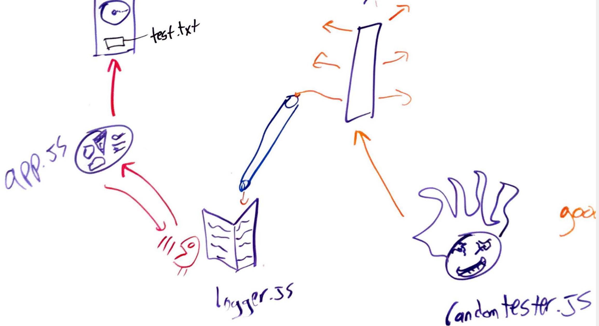

# LAB - 17

## Project Name - lab 17 messages written to a logfile 

### Author: Student/Group Name

### Links and Resources
* [submission PR](http://xyz.com)

#### Documentation
* [api docs](http://xyz.com) (API servers)
* [jsdoc](http://xyz.com) (Server assignments)
* [styleguide](http://xyz.com) (React assignments)

### Modules
#### `modulename.js`
##### Exported Values and Methods

###### `foo(thing) -> string`
Usage Notes or examples

###### `bar(array) -> array`
Usage Notes or examples

### Setup
#### `.env` requirements

#### Running the app
* node server.js
* node logger.js
* node ransomtester.js

now just watch the test.txt file fill up with nonsense logs!

#### Tests

#### UML
